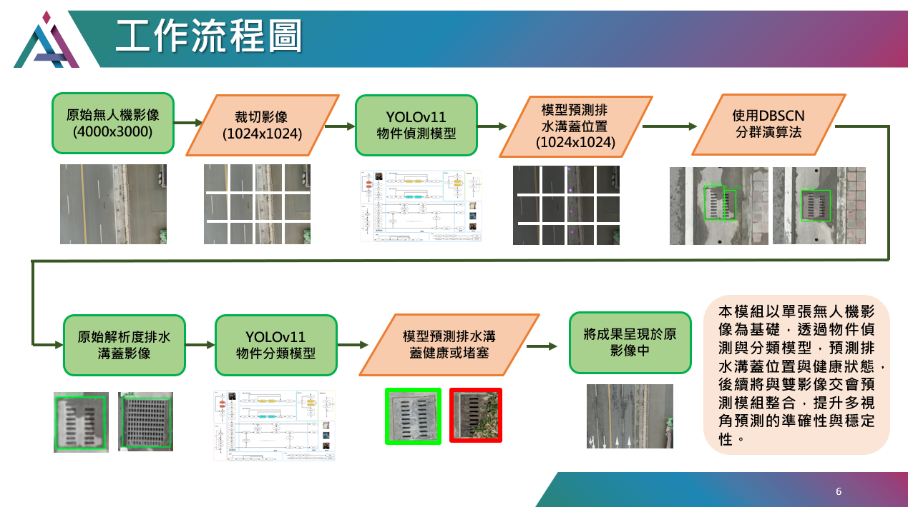

# Ditch Inspection - 自動化排水溝蓋檢測平台

本專案提供基於 UAV（無人機）航拍影像的港區排水溝蓋健康檢測流程，採用 YOLOv11 與多階段分類模型，實現自動化、可重複、可擴展的設施檢查。  
支援 GPU 加速 (CUDA 12.4.1)，同時可於 CPU 環境下推論。

---

## 📍 平台規劃星現 -A區


- POI 共 67 個，經緯度位置於poi資料夾內
- 規劃預測目標：

  排水溝蓋（POI: 1-67)

- 當圖中有檢測到異常(顯示該POI點為紅色)，否則為綠色

---

## 🛠️ 工作流程圖



1. UAV 拍攝原始影像（4000x3000）
2. 切割為 1024x1024 影像
3. 使用 YOLOv11 偵測排水溝蓋位置
4. 物件分類、健康/堵塞判斷
5. DBSCAN 聚類後將結果標示於原影像

---

## ⚙️ Docker CUDA 12.4.1 部署教學

**建議流程：先下載專案，再用 Docker 建置環境執行**

### 1. 下載專案檔案
```bash
git clone https://github.com/xc6571260/ditch_inspection.git
```

### 2. 拉取 CUDA 12.4.1 Image
```bash
docker pull nvidia/cuda:12.4.1-cudnn-devel-ubuntu22.04
```

### 3. 建置 Image
```bash
docker build -t ditch_inspection:cuda12.4 .
```

### 4.1 執行 Container（支援 CUDA12.4）
```bash
docker run --gpus all -it --name ditch_inspection-container ^
  -v D:/your_path/ditch_inspection:/app ^
  -w /app ^
  ditch_inspection:cuda12.4
```

### 4.2 執行 Container（用 CPU 推論）
```bash
docker run -it --name ditch_inspection-container ^
  -v D:/your_path/ditch_inspection:/app ^
  -w /app ^
  ditch_inspection:cuda12.4
```

- `-v`：掛載本機專案資料夾（請依實際路徑調整）
- `-w`：設定工作目錄 `/app`
- 預設執行 `main.py`，推論結果輸出到 `/app/output/`

---

## 📂 專案結構

```
input/      # 原始影像
models/     # 模型檔案
output/     # 預測結果
utils/      # 輔助腳本
main.py     # 主程式
Dockerfile  # Docker 設定
requirements.txt
README.md
```

---

## 📢 注意事項

- 若需推論不同類型目標，請自行調整 input/output/model 內容
- 若有 GPU，建議使用 `--gpus all` 提升效能
- 推論結果會直接同步到本機 output 資料夾

---

## 👤 聯絡方式

- [xc6571260](https://github.com/xc6571260)
- r12521801@ntu.edu.tw
